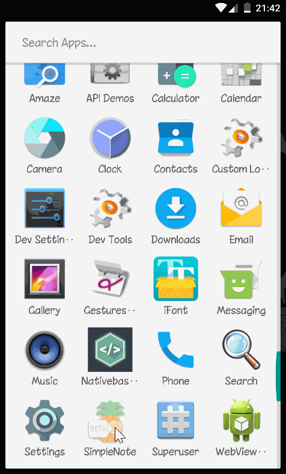

# Aplikasi apa lagi ini?
Aplikasi Simple Note adalah aplikasi catatan sederhana.

setiap catatan terdiri dari 3 item utama yaitu:
 <ol>
     <li>judul catatan</li>
     <li>prioritas catatan (high, medium, low)</li>
     <li>isi catatan</li>
  </ol>

prioritas catatan adalah penting / tidaknya sebuah catatan dengan catatan lain-nya yang mana terbagi 3 :
     <ol>
          <li>high (penting) ditandai dengan warna merah</li>
          <li>medium (biasa) ditandai dengan warna kuning</li>
          <li>low (kurang penting) ditandai dengan warna hijau</li>
     </ol>
 dan dapat diubah sesuai keinginan anda.

fitur lain : tambahkan catatan favorit, sortir catatan

Ini adalah Aplikasi kedua yang saya buat menggunakan React-native tanpa state-management dengan tujuan sebagai hasil evaluasi belajar saya dan bukan ditujukan untuk di komersilkan.

              UI inspired By Gmail and ColorNote.
              
  ## requirements

 * nodeJs >= 8.4.0 & npm >= 5.3.0
 * Python2
 * jdk 8
 * Android sdk
 * Android studio
 * react-native cli

## running
 * Clone repository ini.
 * cd react-native-first-project kemudian npm install
 * running di emulator
      * pastikan emulator anda 'ON'
      * buka terminal di root project run `react-native run-android`
      * maka akan muncul sebuah terminal lagi
 

 ## Preview apps
 

 ## download apk ?
<a href="https://drive.google.com/open?id=1HoEnh5ZtwshJjspN0BOo7_4t6QtXifiR" target="_blank">Downlaod from Google drive [5Mb]</a>
